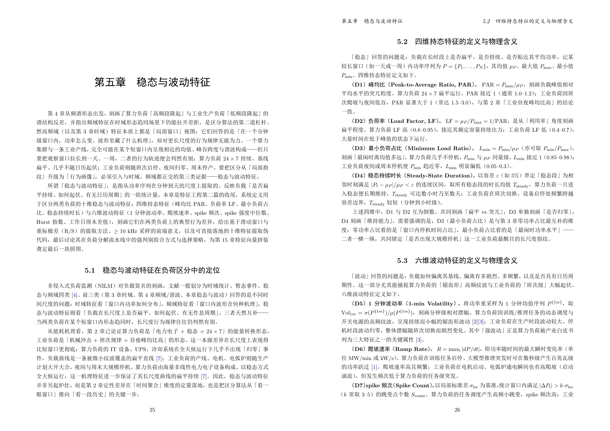
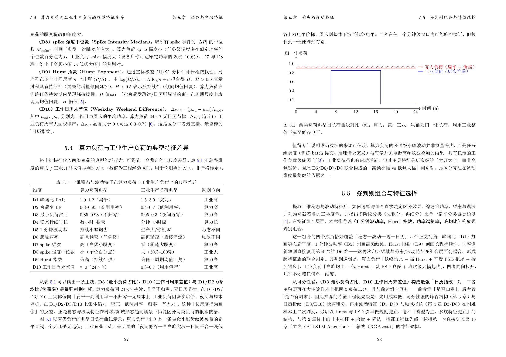

# pdf-maker

> 中文 LaTeX 报告/书籍工程化工具。基于 `xelatex + ctexrep + xeCJK`，把零散章节稳定产出为排版合规的中文 PDF。

`pdf-maker` 把「写一份像样的中文 PDF 报告/书」这件容易翻车的事，固化成一条受控流水线：
**单章独立编译 → 整书合并**，并在每个关键节点设置质量关卡（素材强制阅读、URL 联网验活、
编译日志体检、跨章标签去重）。

## 特性

- **双模式工作流**：单章独立编译 ↔ 整书合并，章节源文件保持干净。
- **源码预处理**（`fix`）：`\url{} → \href{raw}{display}` 规范化、TikZ 图宽上限、
  缺字字形自动修复，生成 `chN.tex` + `_tmp.tex`。
- **素材强制阅读校验**（`reader` 三阶段）：杜绝「读一半就写」。
- **联网验活**（`verify`）：逐 URL 检测可达性，死链必须修（exit 0/1/2）。
- **编译日志体检**（`overflow`）：拦截 Overfull / Missing character / 断链 / 缺字符 / Fatal。
- **排版样式门禁**（`check`，阻断级）：三线表 / 表题在上图题在下 / `codeblock` 伪代码环境。
- **跨章 `\label` 去重**（`labels`）与**合并前引用预检**（`xref`）。
- **零第三方依赖**：仅用 Python 标准库，无需 `pip install` 任何包；模板随包分发。

适用：中文技术报告、调研报告、白皮书、论文（每章 5–15 页，≤ 30 章规模）。

## 效果展示

下图为一章由 `pdfmaker` 自动生成骨架编译出的实际样张（含三线表、TikZ 图、codeblock 伪代码与参考文献）：





- 完整 7 页示例 PDF：[`examples/example.pdf`](examples/example.pdf)

## 环境要求

| 依赖 | 版本 / 说明 | macOS 安装 |
|------|------------|-----------|
| TeX Live | 2022+（含 `xelatex`、`ctexrep`、`xeCJK`） | `brew install --cask mactex`（完整版，需 sudo）或 `brew install --cask basictex`（精简版，装后需 `sudo tlmgr install ctex xecjk tcolorbox booktabs multirow tabularx adjustbox enumitem`）；**免 sudo**：官方 `install-tl` 装到 `~/texlive/<年份>` 或 TinyTeX 装到 `~/Library/TinyTeX`，`find_xelatex` 均会自动探测 |
| Python | **3.10+**（macOS 自带的 `/usr/bin/python3` 可能低于 3.10，建议用 Homebrew Python） | `brew install python` |
| `pdfinfo` | poppler（可选，用于元数据校验） | `brew install poppler` |

> 工具本身零第三方依赖，不需要安装任何 PyPI 包。

## 安装

### 作为 Python 包（推荐，开源用法）

```bash
# 从源码可编辑安装（开发用）
cd pdf-maker
pip install -e .

# 或直接构建安装
pip install .
```

安装后即可使用 `pdfmaker` 命令或 `python -m pdfmaker`：

```bash
pdfmaker --help
python -m pdfmaker build .
```

### 作为 Claude Code 技能

把本仓库放到 Claude Code 技能加载路径，再安装一次（两步缺一不可）：

```bash
# 用户级（跨项目可用）
cp -r pdf-maker ~/.claude/skills/pdf-maker/

# 或项目级（仅当前仓库协作者可用）
cp -r pdf-maker <your-project>/.claude/skills/pdf-maker/

# 必须：让 pdfmaker 包进入 Python 环境
cd ~/.claude/skills/pdf-maker && pip install -e .
```

## 快速开始

### 1. 生成书稿骨架

`scaffold` 会把内置的 `main.tex` / `_tmp.tex` 模板落地为可编译起点，并按需生成章节占位：

```bash
python -m pdfmaker scaffold my-report                 # 生成 my-report/（默认 1 章）
python -m pdfmaker scaffold . --chapters N            # 在当前目录生成 N 章骨架
python -m pdfmaker scaffold book --title "我的书" --author 张三
python -m pdfmaker scaffold note --flat               # 扁平布局：第1章.tex 直接在项目根（推荐单章写作）
```

生成的目录（标准布局）：

```
my-report/
  main.tex        # 整书主控（占位符已填默认 / 由参数指定）
  _tmp.tex        # 单章编译 preamble 模板（fix 用）
  第1章/
    第1章.tex     # 章节占位源（合规富骨架，含可编译示例）
```

扁平布局（`--flat`，单章写作推荐）不建章目录，章节源文件与成品 PDF 都在一级目录：

```
note/
  main.tex        # \input{第1章}（扁平路径）
  _tmp.tex
  第1章.tex       # 章节源直接在项目根
  第1章.pdf       # cleanup 后成品落在这里（一级目录）
```

> 无需把模板复制到项目里：`fix` 与 `build` 都从包数据 `pdfmaker.templates` 读取模板。

### 2. 写一章（完整 SOP）

在**书稿项目根目录 `<PROJECT>`** 下执行：

```bash
cd <PROJECT>

# 1) 强制阅读素材（一键通读；也可 index+chunk+verify 三阶段分步）
#    多章约定：素材放章节文件夹 第N章/素材-第N章.md；扁平单章项目素材在项目根
python -m pdfmaker reader ingest "第1章/素材-第1章.md"

# 2) 撰写 第1章/第1章.tex
#    （章文件缺失时，chapter 1 --material 第1章/素材-第1章.md 会自动生成合规富骨架起稿；
#      --material 给裸文件名「素材-第1章.md」也可，章节文件夹与项目根两种约定自动解析）

# 3) 预处理（生成 ch1.tex + _tmp.tex）
python -m pdfmaker fix 1

# 4) 结构校验
python -m pdfmaker check 1
python -m pdfmaker balance 1

# 5) 联网验活（强制；exit 0 继续 / 1 修链接 / 2 离线重跑）
python -m pdfmaker verify 1

# 6)+7) 编译 + 日志体检（一步完成；自动定位 xelatex，无需 cd 进章目录、无需 PATH）
python -m pdfmaker compile 1
#   --verbose：全量回显 xelatex 输出（默认静默，仅失败时回显末尾 40 行）
#   --no-overflow：只编译不体检（不推荐）
#   旧式手动写法（仍兼容）：cd 第1章 && xelatex _tmp.tex 两遍，再 overflow 第1章/_tmp.log

# 8) 清理落盘
python -m pdfmaker cleanup 1

# 9) 更新素材追踪（--auto 免手抄：size/lines 取章节 .tex 实测，chunks 取素材阅读状态）
python -m pdfmaker track update <PROJECT> 第1章 --auto --material 第1章/素材-第1章.md
#   也兼容显式三整数：track update <PROJECT> 第1章 <size> <lines> <chunks>
#   --material 第1章/素材-第1章.md：把该素材写入 source_files，便于追溯关联素材
#   --unverified：verify 离线退出 2 时明确标记本章未验活
```

`overflow` 若不传日志路径，会在当前目录自动寻找 `_tmp.log` / `main.log`。

### 3. 整书合并

所有章节 OK 后，**统一用 `build` 一键合并**（自动跑 `labels` → `xref`
预检 → 规范化 → `xelatex` 两遍 → `overflow` → 落盘 `main.pdf`；规范化与单章同一套
`normalize_text`，确保 TikZ/URL 处理完全一致）：

```bash
cd <PROJECT>
python -m pdfmaker build .              # 合并，exit 0 即成功
python -m pdfmaker build . --verify     # 合并前额外联网验活全书 URL
pdfinfo main.pdf                        # 校验 Title / Author 元数据
```

> 不要手敲 `xelatex main.tex`——那会直接 `\input` 原始章节、漏掉规范化，导致「单章不溢出、
> 合并却 Overfull」。

## 项目结构

```
pdf-maker/
├── README.md                      # 本文件
├── SKILL.md                       # Claude Code 技能定义（触发、红线与流程概要）
├── LICENSE                        # MIT
├── CHANGELOG.md                   # 版本里程碑
├── CONTRIBUTING.md                # 贡献指南
├── pyproject.toml                 # 打包（setuptools，零第三方依赖）
├── .gitignore
├── examples/                      # 样张（example.pdf + 预览图）
├── src/
│   └── pdfmaker/                  # 标准 Python 包（可 pip install -e .）
│       ├── __init__.py            #   版本号
│       ├── __main__.py            #   python -m pdfmaker 入口
│       ├── cli.py                 #   子命令分发
│       ├── py.typed               #   类型标记
│       ├── core/                  #   共享纯函数（路径/文本/规范化/章节/lint/配置/xelatex/看门狗）
│       │   ├── paths.py           #     路径定位 / UTF-8 / 模板定位 / 素材定位
│       │   ├── config.py          #     集中配置（环境变量 + .pdfmaker.toml 覆盖）
│       │   ├── text.py            #     字数统计（剔除图/代码/文献，保留表格单元格）
│       │   ├── normalize.py       #     单一规范化真源（URL → href + TikZ 上限 + 字形修复 + 长 \texttt 拆词）
│       │   ├── chapters.py        #     章节枚举与排序
│       │   ├── lint.py            #     编译前风险预检（缺字/截断URL/TikZ/三线表/伪代码样式/不可断行长串/单列挤压）
│       │   ├── xelatex.py         #     超时保护的 xelatex 调用封装
│       │   └── watchdog.py        #     扫描看门狗（SIGALRM 墙钟时限，超时阻断）
│       ├── commands/              #   每个子命令一个模块，暴露 main(argv)->int
│       │   ├── fix.py             #     单章预处理
│       │   ├── check.py           #     结构统计 + 风险预检（含 \texttt 不可断行长串 / tabularx 单列挤压）+ 排版样式门禁（阻断级）+ 字数门禁（告警级）
│       │   ├── balance.py         #     结构/引用均衡（阻断/建议分明）
│       │   ├── lint.py            #     单章快速预检（check+balance 合并，仅提示不阻断）
│       │   ├── compile.py         #     单章编译一体化（自动定位 xelatex → 两遍 → 日志体检）
│       │   ├── overflow.py        #     编译日志体检（硬卡口）
│       │   ├── xref.py            #     合并前引用预检
│       │   ├── verify.py          #     联网验活（exit 0/1/2）
│       │   ├── build.py           #     整书合并唯一入口
│       │   ├── chapter.py         #     单章全流程 SOP 一键编排
│       │   ├── cleanup.py         #     成品落盘 + 归档
│       │   ├── labels.py          #     跨章 label 去重
│       │   ├── reader.py          #     素材阅读校验
│       │   ├── track.py           #     章节↔素材阅读状态追踪
│       │   └── scaffold.py        #     书稿骨架生成（整书初始化 + 单章从素材生成）
│       └── templates/             #   包内 LaTeX 模板 + 章节阅读笔记模板
│           ├── main.tex           #     整书主控模板
│           ├── _tmp.tex           #     单章编译 preamble 唯一真源
│           ├── _preamble_shared.tex  #  共用补丁片段唯一真源（{{SHARED_PREAMBLE}}）
│           └── chapter_init_notes_template.md
└── tests/                         # pytest 测试套件（conftest.py 注入 src/，免安装直接跑）
```

## 测试

```bash
# 无需安装包：conftest.py 会把 src/ 注入 sys.path
python3 -m pytest tests/ -q
```

## 命令参考

所有命令均支持 `-h` 查看准确参数与示例。核心子命令：

| 命令 | 用法 | 说明 |
|------|------|------|
| `scaffold` | `scaffold <dir> [--title T] [--author A] [--chapters N] [--appendices M] [--flat] [--force]` | 初始化书稿骨架（`--flat` 扁平布局：第N章.tex 在项目根；`--force` 允许非空目录，已存在文件跳过不覆盖） |
| `scaffold chapter` | `scaffold chapter N [--material F] [--root D] [--flat] [--force]` | 从素材生成单章合规富骨架（`--flat` 扁平布局） |
| `reader` | `reader {ingest,index,chunk,verify,toc,clean} <file>` | 素材校验；`ingest` 一键通读（素材未变更时缓存短路，`--force` 强制重读）；`clean` 清阅读状态 |
| `track` | `track {init,show,check,update,stale,auto-init,bib-audit} <PROJECT> [chapter] [--auto] [size lines chunks]` | 阅读状态追踪；`update --auto` 自动取数免手抄；`stale` 检测 verified 后源文件是否被改动 |
| `fix` | `fix [chapter]`（默认 1） | 单章预处理（生成 `chN.tex` + `_tmp.tex`） |
| `compile` | `compile [chapter] [--xelatex X] [--verbose] [--no-overflow]` | 单章编译一体化：自动定位 xelatex（无需 PATH）→ `_tmp.tex` 编译两遍 → overflow 体检；默认静默，失败回显输出末尾 40 行 |
| `check` | `check [chapter] [--min-chars N] [--max-chars N] [--no-gate] [--strict] [--count-mode cjk\|visible]` | 结构统计 + 风险预检 + 排版样式门禁（阻断）+ 字数门禁（默认仅 WARN 不阻断，`--strict` 恢复硬阻断） |
| `balance` | `balance [chapter]` | 结构/引用均衡（阻断项 exit 1，建议项不阻断） |
| `lint` | `lint [chapter]` | 单章快速预检（check+balance 合并，永远 exit 0，边写边查） |
| `xref` | `xref [target] [--self-only] [--expected N]`（`.` 或 `N` 或 `.tex`） | 合并前预检：越界「第N章」引用 / 跨章 `\ref` |
| `verify` | `verify <target>`（`N` / `.tex` / `.` 整书）`[--retries N] [--timeout S] [--cache P] [--refresh]` | 联网验活（exit 0/1/2；401/403/429 算 LIVE；结果可缓存） |
| `build` | `build [root]`（默认 `.`）`[--verify] [--no-preflight] [--verbose]` | **整书合并唯一入口**；默认静默编译，`--verbose` 全量回显 xelatex 输出；非阻断告警在末尾汇总重列，防长输出淹没 |
| `chapter` | `chapter <N> [--material F] [--project P] [--xelatex X] [--flat] [--force-cwd] [--no-verify] [--no-track]` | **单章全流程 SOP 一键编排**：reader → fix → check → balance → verify → xelatex×2 → overflow → cleanup → track，任一步阻断即中止；`--flat` 让自动起稿用扁平布局；占位骨架（未编辑的「未命名章标题」）给了 `--material` 会自动再生为素材富骨架并早退引导；CWD 守卫拒绝在非项目根目录创建章骨架（`--force-cwd` 豁免） |
| `overflow` | `overflow [log]` | 日志体检，省略则自动找 `_tmp.log`/`main.log` |
| `cleanup` | `cleanup [chapter]` | 落盘 + 归档中间文件 |
| `labels` | `labels [root]`（默认 CWD） | 跨章 `\label` 去重 |

## 配置与环境变量

所有可调项集中在 `src/pdfmaker/core/config.py`，**统一通过 `PDFMAKER_` 前缀的环境变量覆盖**，
无需改代码即可按项目调参（CI / 受限网络环境尤其有用）：

| 环境变量 | 默认 | 作用 |
|----------|------|------|
| `PDFMAKER_CHAPTER_MIN_CHARS` | `2000` | `check` 整章字数告警下限；项目要求如 4000 字/章则设 `4000`（仅告警，除非 `--strict`） |
| `PDFMAKER_CHAPTER_MAX_CHARS` | `0` | `check` 整章字数告警上限（0=不限制；策略同下限） |
| `PDFMAKER_CHAPTER_COUNT_MODE` | `cjk` | 字数计数口径（`cjk`=仅中文 / `visible`=非空可见字符） |
| `PDFMAKER_MIN_REFS` | `0` | `balance` 参考文献数建议下限（0=不设下限，按需引用；零引用章是合法形态） |
| `PDFMAKER_TMP_OLD_KEEP` | `10` | `cleanup` 的 `_tmp_old/` 归档份数上限（0=不清理） |
| `PDFMAKER_URL_TIMEOUT` | `30.0` | `verify` 单 URL 超时（秒） |
| `PDFMAKER_URL_RETRIES` | `3` | `verify` 单 URL 重试次数 |
| `PDFMAKER_URL_WORKERS` | `8` | `verify` 并发线程数 |
| `PDFMAKER_BACKOFF` | `2.0` | `verify` 重试退避基数（秒） |
| `PDFMAKER_USER_AGENT` | `Mozilla/5.0 (pdf-maker verify) compatible` | `verify` 请求 UA |
| `PDFMAKER_PROBE_HOSTS` | `example.com,archive.org,w3.org` | `verify` 离线连通性探针主机 |
| `PDFMAKER_VERIFY_CACHE_TTL_DAYS` | `7` | `verify` 结果缓存新鲜度（天） |
| `PDFMAKER_VERIFY_CACHE_DIR` | macOS: `~/Library/Caches/pdfmaker`；其他： `~/.cache/pdfmaker` | `verify` 结果缓存目录 |
| `PDFMAKER_READER_STATE_DIR` | macOS: `~/Library/Caches/pdfmaker/reader`；其他： `~/.cache/pdfmaker/reader` | `reader` 阅读状态存放目录（全局缓存，不污染内容目录） |
| `PDFMAKER_CHUNK_SIZE_CN` / `_EN` | `200` / `320` | `reader` 中/英文素材单 chunk 行数 |
| `PDFMAKER_XELATEX` | （空） | xelatex 可执行文件路径（空则运行时探测） |
| `PDFMAKER_XELATEX_TIMEOUT` | `300.0` | xelatex 单次编译超时（秒） |
| `PDFMAKER_SCAN_TIMEOUT` | `30.0` | `check`/`balance`/`xref`/`fix` 扫描看门狗时限（秒，Unix 主线程生效）；超时按阻断 exit 1 |
| `PDFMAKER_LONGRUN_WARN_CHARS` | `25` | `check`/`lint` 的 `\texttt` 不可断行长串预警阈值（字形数；0=关闭） |
| `PDFMAKER_TEXTTT_RELAX_CHARS` | `20` | `fix`/`build` 规范化时长 `\texttt` 自动拆词（插入 `\allowbreak`）阈值（字形数，CJK 按 2 计；0=关闭） |
| `PDFMAKER_TABLE_SQUEEZE_WARN_CHARS` | `20` | `check`/`lint` 的 tabularx 非 X 列「单列挤压」预警阈值（字形数；0=关闭） |
| `PDFMAKER_VERIFY_ALLOW_HOSTS` | （空） | `verify` 验活豁免主机名单（逗号分隔，精确或子域名后缀匹配；内网/SSO 鉴权后可见的合法链接标记 EXEMPT 按已验证处理） |

### 质量门禁一览

- **阻断级（exit≠0 即停）**：排版样式退化（裸 `\hline`/竖线、缺顶底线、表题图题错位、裸 verbatim）、
  悬空 `\cite`、死链、编译失败、日志体检阻断项；`chapter` 遇未撰写的占位骨架也会显式阻断。
- **告警级（WARN 不阻断）**：字数未达下限（`--strict` 升为阻断，`--no-gate` 完全关闭）、
  `build` 遇占位骨架、写作期 Overfull 预警（`\texttt` 不可断行长串 / tabularx 单列挤压）。
- **Overfull 三层治理**：写作期 `check`/`lint` 预警 → 规范化自动给长 `\texttt` 插 `\allowbreak{}`
  → 编译后 `overflow` 附源文件行号定位（落入表格时列出候选单元格）。
- **`verify` 语义**：死链（404/410）必须修；401/403/429 等访问受限算 LIVE 不误杀；离线/瞬时故障
  exit 2 可重跑，确定结论带缓存复用；内网/SSO 主机用 `PDFMAKER_VERIFY_ALLOW_HOSTS` 豁免（EXEMPT）。
- **推荐写作节奏**：`lint N`（check+balance 合并、永不阻断）随写随查，满意后再跑 `chapter N`
  完整流程一次，避免「改三个字重跑全链路」。

## 项目级配置（`.pdfmaker.toml`）

除环境变量外，还可在**书稿项目根目录**放一个 `.pdfmaker.toml`，让配置随项目走、不再依赖每次手动设环境变量。`cli` 在分发子命令前会自动向上回溯查找并加载，**无需任何额外参数**。

优先级：**环境变量 > `.pdfmaker.toml` > 代码默认**（设了环境变量则该键忽略 toml）。

```toml
[pdfmaker]
chapter_min_chars = 4000         # 覆盖 PDFMAKER_CHAPTER_MIN_CHARS
min_chars        = 4000          # balance 全书/整章下限
min_tables       = 2             # balance 每章表格下限
min_images       = 1             # balance 每章配图下限
url_timeout      = 20.0          # 覆盖 PDFMAKER_URL_TIMEOUT
url_workers      = 12            # 覆盖 PDFMAKER_URL_WORKERS
probe_timeout    = 4.0           # 覆盖 PDFMAKER_PROBE_TIMEOUT
url_retries      = 4             # 覆盖 PDFMAKER_URL_RETRIES
backoff          = 2.0           # 覆盖 PDFMAKER_BACKOFF
user_agent       = "Mozilla/5.0 (pdf-maker) compatible"  # 覆盖 PDFMAKER_USER_AGENT
verify_cache_ttl_days = 7        # 覆盖 PDFMAKER_VERIFY_CACHE_TTL_DAYS
verify_allow_hosts = ["internal.example.com"]  # 覆盖 PDFMAKER_VERIFY_ALLOW_HOSTS（验活豁免主机）
texttt_relax_chars = 20          # 覆盖 PDFMAKER_TEXTTT_RELAX_CHARS（长 `\texttt` 自动拆词阈值）
table_squeeze_warn_chars = 20    # 覆盖 PDFMAKER_TABLE_SQUEEZE_WARN_CHARS（单列挤压预警阈值）
chunk_size_cn    = 200           # 覆盖 PDFMAKER_CHUNK_SIZE_CN
chunk_size_en    = 320           # 覆盖 PDFMAKER_CHUNK_SIZE_EN
max_bytes_per_read = 200000      # 覆盖 PDFMAKER_MAX_BYTES_PER_READ
xelatex          = "xelatex"     # 覆盖 PDFMAKER_XELATEX；留空或 "xelatex" 时运行时沿 PATH 自动探测

# 离线探针主机（覆盖 PDFMAKER_PROBE_HOSTS），默认 example.com,archive.org,w3.org
probe_hosts = ["https://arxiv.org", "https://doi.org", "https://link.springer.com"]

# 参考文献权威站点提示（bib-audit / 验活判 LIVE 时加权），覆盖默认清单
authority_hints = ["doi.org", "arxiv.org", "springer.com", "link.springer.com",
                   "springeropen.com", "frontiersin.org", "ieee.org", "mdpi.com",
                   "acm.org", "nature.com", "science.org", "wiley.com", "stanford.edu"]

# 阅读状态 / 验活缓存目录（覆盖平台默认：macOS ~/Library/Caches/pdfmaker/...，其他 ~/.cache/pdfmaker/...）
reader_state_dir = "~/Library/Caches/pdfmaker/reader"
verify_cache_dir = "~/Library/Caches/pdfmaker"
```

> 查找规则：从当前工作目录（或 `--project` 指定目录）向上逐级父目录回溯，命中最近的 `.pdfmaker.toml` 即停止。`chapter` / `build` / `check` / `balance` / `verify` / `track` 全部受益（例如 `chapter` 编排里 `check` 的字数门禁会直接套用 `chapter_min_chars=4000`）。

### 排版符号自动修复（glyph auto-fix）

`fix` 与 `build` 在规范化阶段（同一套 `normalize_text`）会**自动把常见 Unicode 数学/圈号字符转为 LaTeX 安全写法**，避免 `xelatex` 报 Missing character 或 PDF 显示豆腐块：

| 输入字符 | 转写 |
|----------|------|
| `≥` `≤` `≈` `≠` | `\ge` `\le` `\approx` `\neq` |
| ①–⑩ | `(1)`–`(10)` |

受保护片段（URL、`\href{}`、`\verb`、`verbatim`、`codeblock`）内的字符**不转换**，确保链接与代码原样保留。该步骤幂等，纯 ASCII 文本无任何影响。

### 单章全流程一键编排（`chapter`）

不想逐步手敲 9 条命令时，用 `chapter` 一条命令跑完整 SOP：

```bash
cd <PROJECT>
python -m pdfmaker chapter 3                 # 第 3 章全链路：reader → fix → check → balance → verify → xelatex×2 → overflow → cleanup → track
python -m pdfmaker chapter 3 --material 素材.md   # 顺带先 ingest 指定素材
python -m pdfmaker chapter 3 --no-verify     # 离线时跳过联网验活
python -m pdfmaker chapter 3 --no-track      # 跳过素材追踪更新
python -m pdfmaker chapter 3 --xelatex "/path/to/xelatex"  # 显式指定编译引擎
```

- 编排顺序严格遵循 SOP：`check` 的排版样式/悬空引用与 `balance` 的阻断项为**硬卡口**（exit≠0 立即中止，便于就地补正文/补结构）；`check` 的字数门禁仅 WARN 不阻断；章文件仍是未撰写骨架时由骨架守卫显式阻断；`verify` 仅 `exit 1`（死链）阻断、`exit 2`（离线/瞬时）仅告警继续；`xelatex` 连跑两遍（自动定位，无需 cd 进章目录，`--halt-on-error`）；`track update` 若章节尚未登记会自动 `init` 再写，无需先手动登记。
- 编译引擎解析顺序：`--xelatex` > 环境变量 `PDFMAKER_XELATEX` > `.pdfmaker.toml` 的 `xelatex` > 运行时沿 PATH 探测（与 `build` 同一套 `find_xelatex`）。

## URL 写法（中文 / 特殊字符）

- **必须用** `\href{raw-url}{display-text}`；**不要用** `\url{}`（会触发 hyperref 的 percent-decode bug，中文易出错）、`\nolinkurl`（杀掉超链接）。
- `fix` 已自动把章节里的 `\url{...}` 转成 `\href{raw}{display}`（`url_to_href` 实现），但**手写新链接**时直接写 `\href` 最稳妥。
- `hyperref` 自动把 raw-url percent-encode 写入 PDF 注解（不会双编码）；**不要**预先 percent-encode 再进 `\href`。
- 显示文本里的 LaTeX 特殊字符需转义：`_` → `\_`、`&` → `\&`、`$` → `\$`、`#` → `\#`、`%` → `\%`、`\` → `\textbackslash{}`。

## 参考文献与标签约定

- **bibitem 键加章号前缀**：`c1r1`、`c2r3`…（第 N 章第 M 条），保证跨章不冲突。
- **`\cite` 必有对应 `\bibitem`**：`balance` 会检测孤儿 bibitem 与悬空 cite。
- **`\label` 加章号前缀**：如 `\label{sec:c3-food}`；`labels` 作为兜底再扫一遍跨章重复。
- 章末 `thebibliography` 用 `\bibitem{cNrM} 作者. 标题[EB/OL]. \href{url}{display}` 形式。

## 模板说明

### `templates/_tmp.tex`（单章 preamble 唯一真源）

- `fix` 读取本文件，把 `\input{CHAPTER_TEX}` 替换为实际章节中间文件（`chN.tex` / `附录X_ch.tex`），写出 `第N章/_tmp.tex` 交 xelatex 编译。
- 已预置关键补丁，章节源文件无需关心：`中文 URL 支持`、`参考文献降级 + 不跳页 + 不改页眉`、`代码块环境 codeblock`、`图片宽度上限 adjustbox`、`emergencystretch 防溢出`。
- **禁止**在 `fix` 内再内联一份 preamble 副本（双源漂移）。

### `templates/main.tex`（整书主控）

- 合并时所有章节的唯一入口，把各章 `\input` 进来，统一页面/页眉页脚/参考文献样式。
- 使用步骤：
  1. 替换 `{{TITLE}}` / `{{SUBTITLE}}` / `{{EPIGRAPH}}` / `{{EPIGRAPH_CLOSING}}` / `{{AUTHOR}}` / `{{DATE}}` / `{{PDF_TITLE}}` 占位符。
     - `{{TITLE}}` 用于扉页显示，可含 `\\`；`{{PDF_TITLE}}` 用于 PDF 元数据，**必须单行、不含 `\\`**。
  2. 在「正文各章」处把 `{{CHAPTERS_LIST}}` 替换为每章一行 `\input{第N章/第N章}`。
  3. 不需要扉页/序言/附录/结尾段，删除对应整块。
  4. `xelatex` 跑两遍。
  5. 收尾删 `main.aux/log/out/toc`。
- `_tmp.tex` 与 `main.tex` 的关键补丁都来自同一份 `templates/_preamble_shared.tex`
  （经 `{{SHARED_PREAMBLE}}` 占位符注入）；两者的页眉均为内核原生自绘 pagestyle
  （`\@evenhead` / `\@oddhead`，偶数页章题 / 奇数页节题），差异仅在前置部分与章节
  装入方式，非双源漂移。

## 关键概念

- **双模式**：单章独立编译（每章 `\chapter` → 验证 → 下一章）与整书合并（`main.tex` `\input` 各章 → `main.pdf`）二选一，混用即 bug。
- **单一规范化真源**：`normalize_text()` = `url_to_href()` + `wrap_tikz()` + `fix_glyphs()` + `relax_long_texttt()`，单章与合并共用，幂等，从根上消除双源漂移。
- **三阶段阅读**：动笔前 `reader` 跑 `index → chunk → verify`，确保素材被完整通读；
  阅读状态存放在全局缓存目录（macOS 为 `~/Library/Caches/pdfmaker/reader`），不污染书稿内容目录。
- **日志体检**：编译后必须跑 `overflow`，把阻断级信号拦在交付前。

## 开发

```bash
pip install -e .               # 可编辑安装
python -m pdfmaker --help      # 查看子命令
python3 -m pytest tests/ -q    # 跑测试套件
```

## 贡献

欢迎提交 Issue 与 Pull Request。详见 [CONTRIBUTING.md](CONTRIBUTING.md)。改动保持单一职责、显式 `import`，共享逻辑进 `pdfmaker.core`。

## 许可证

MIT —— 见 [LICENSE](LICENSE)。
